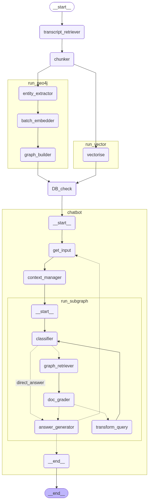
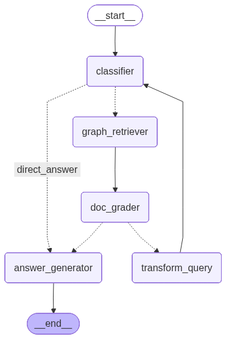

# 🎙️ YouTube RAG Chatbot

> **Stop wasting time on long lectures.**
> Upload any audio file — the system builds a full knowledge base from it, so you can ask exactly what you want and get the answer instantly, without sitting through the whole thing.

---

## What it does

Most learning content is long. Lectures, podcasts, recorded meetings — you often only need 10% of it but have no choice but to listen to all of it.

This project solves that. You upload an audio file. It transcribes it, extracts every concept and relationship from the content, stores everything in a vector database and a knowledge graph, and then lets you chat with it. Ask anything — it retrieves only what's relevant and answers precisely.

---

## Branches

| Branch | Description |
|---|---|
| `master` | Core pipeline — runs entirely in terminal, no UI |
| `streamlit_ui` | Same pipeline with a Streamlit web interface |

---

## Architecture

### Overall workflow-Terminal Version



### Query Pipeline — Adaptive RAG



## Tech Stack

| Layer | Tool |
|---|---|
| Transcription | AssemblyAI |
| Embeddings | NVIDIA `baai/bge-m3` |
| LLM (reasoning) | NVIDIA `moonshotai/kimi-k2-instruct` → Groq fallback |
| LLM (generation) | NVIDIA `moonshotai/kimi-k2-instruct` → Groq fallback |
| Vector store | Pinecone |
| Knowledge graph | Neo4j |
| Orchestration | LangGraph |
| UI (streamlit branch) | Streamlit |

---

## API Keys Required

You need accounts and API keys for the following services:

| Service | Used for | Get it at |
|---|---|---|
| `ASSEMBLYAI_API_KEY` | Audio transcription | [assemblyai.com](https://www.assemblyai.com) |
| `NVIDIA_API_KEY` | Embeddings + LLM (primary) | [build.nvidia.com](https://build.nvidia.com) |
| `GROQ_API_KEY` | LLM fallback | [console.groq.com](https://console.groq.com) |
| `PINECONE_API_KEY` | Vector store | [pinecone.io](https://www.pinecone.io) |
| `NEO4J_URI` | Graph database | [neo4j.com/cloud](https://neo4j.com/cloud) |
| `NEO4J_USERNAME` | Graph database | same as above |
| `NEO4J_PASSWORD` | Graph database | same as above |

---

## Setup & Installation

### 1. Clone the repo

```bash
# master branch (terminal only)
git clone -b master https://github.com/vaslin-dotcom/youtube_RAG_Chatbot.git

# streamlit branch (with UI)
git clone -b streamlit_ui https://github.com/vaslin-dotcom/youtube_RAG_Chatbot.git

cd youtube_RAG_Chatbot
```

### 2. Create a virtual environment

```bash
python -m venv venv

# Windows
venv\Scripts\activate

# Mac / Linux
source venv/bin/activate
```

### 3. Install dependencies

```bash
pip install -r requirements.txt
```

### 4. Create your `.env` file

Create a file named `.env` in the root of the project:

```env
ASSEMBLYAI_API_KEY=your_key_here
NVIDIA_API_KEY=your_key_here
GROQ_API_KEY=your_key_here
PINECONE_API_KEY=your_key_here
NEO4J_URI=your_uri_here
NEO4J_USERNAME=your_username_here
NEO4J_PASSWORD=your_password_here
```

### 5. Pinecone index setup

Create an index in your Pinecone dashboard with these settings:

```
Index name  : youtube-rag
Dimensions  : 1024
Metric      : cosine
```

---

## How to Run

### `master` branch — terminal

```bash
python mainGraph.py
```

This runs the ingestion pipeline. Edit the `audio_path` inside `mainGraph.py` to point to your audio file.

Once ingestion is complete, start the chat:

```bash
python supervisorSubgraph.py
```

Type your questions. Type `exit` to quit.
To reset dtabase manually at any time:

```bash
python reset_db.py
```

---

### `streamlit_ui` branch — web UI

```bash
streamlit run app.py
```

Open your browser at `http://localhost:8501`

1. **Upload Audio** — drag and drop any audio file (mp3, wav, m4a, ogg, flac, webm)
2. Click **Process Audio** — watch live progress as the pipeline runs
3. Once complete, go to **Chat** from the sidebar
4. Ask anything about the audio content
5. When done, use **Reset DB** to wipe both databases

---

## Project Structure

```
youtube_RAG_Chatbot/
│
├── config.py               # API keys, clients, shared notify()
├── schemas.py              # All TypedDict and Pydantic schemas
├── llm.py                  # SmartLLM — NVIDIA primary, Groq fallback
├── prompts.py              # All prompt templates
├── helper_functions.py     # KG extraction, Neo4j writes, formatting
├── reset_db.py             # Wipe Pinecone + Neo4j
│
├── mainGraph.py            # Ingestion pipeline (transcript → DB)
├── vectorSubgraph.py       # Pinecone ingestion subgraph
├── neo4jSubgraph.py        # Neo4j ingestion subgraph (parallel)
│
├── adaptiveRagSubgraph.py  # Adaptive RAG query pipeline
├── supervisorSubgraph.py   # Chat loop manager (master branch)
│
└── app.py                  # Streamlit UI (streamlit_ui branch only)
```

---

## How the LLM fallback works

To stay under API rate limits and handle downtime, every LLM call goes through a `SmartLLM` wrapper:

```
Request
  ↓
NVIDIA (primary — 40 RPM)
  ↓ if rate limit or 503
Groq primary model
  ↓ if rate limit
Groq fallback model
  ↓ if all fail
raises exception
```

---

## How parallel extraction works

For large audio files with many chunks, entity extraction runs in parallel:

```
67 chunks → 8 workers → ~35 seconds
vs
67 chunks → 1 worker  → ~1 hour
```

Workers are staggered to stay safely under NVIDIA's 40 RPM limit, with automatic fallback to Groq if the limit is hit mid-batch.

---

## Resetting the databases

```bash
python reset_db.py
```

This clears all vectors from Pinecone and all nodes/relationships from Neo4j. Run this before processing a new audio file if you want a clean slate.

---

## License

MIT